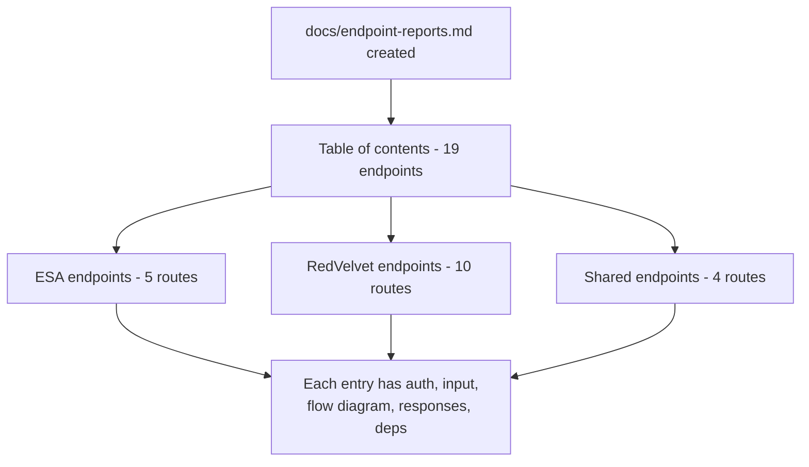

## Summary

Adds `docs/endpoint-reports.md` — a comprehensive reference document covering all 19 server API endpoints. Each entry was generated from source using the [`endpoint-report`](https://github.com/agabrie/claude-skills/tree/main/endpoint-report) skill and includes auth requirements, input schema, a Mermaid logic-flow diagram, all HTTP response variants with example payloads, and a dependency list. This gives new contributors and reviewers a single place to understand the full API surface without reading every handler file.

---

## Commit: `af1627f` — docs: add endpoint reports for all 19 server API routes

- Created `docs/endpoint-reports.md` (1 425 lines, new file)
- Documents all 19 routes across both providers (ESA and RedVelvet) plus shared endpoints
- Each report covers: auth, input table, Mermaid `flowchart TD`, response variants with JSON examples, and named dependencies
- Highlights non-obvious behaviours: size-fallback chain in the image relay, two-tier `metaCache`/`detailCache` in RV profile details, racial-tag union vs non-racial intersection in `/redvelvet-search`, ASP.NET `__doPostBack` pagination, session-expiry retry logic, and `tag-overrides.json` stub injection

### After

---

## New / Modified Endpoints

No API routes were added or modified in this branch. This is a documentation-only change.

---

## Test plan

- [ ] Open `docs/endpoint-reports.md` on GitHub and verify all 19 Mermaid diagrams render without syntax errors
- [ ] Spot-check `GET /image` section: confirm size-fallback chain and 8 MB cap are accurately described
- [ ] Spot-check `POST /redvelvet-search` section: confirm racial-union vs non-racial-intersection logic matches `src/server/redvelvet/search.js`
- [ ] Spot-check `GET /redvelvet-profile-details`: confirm two-tier cache and session-expiry retry are documented
- [ ] Verify the table of contents links resolve correctly within the document
