# ESA Server API — Endpoint Reports

Generated from source using the [`endpoint-report`](https://github.com/agabrie/claude-skills/tree/main/endpoint-report) skill.

---

## Table of Contents

| # | Method | Route | Handler |
|---|---|---|---|
| 1 | GET | `/image` | `middleware/image-relay.js` |
| 2 | GET | `/rv-auth-status` | `redvelvet/auth.js` |
| 3 | GET | `/redvelvet-area` | `redvelvet/areas.js` |
| 4 | GET | `/redvelvet-area-profiles` | `redvelvet/areas.js` |
| 5 | GET | `/redvelvet-areas` | `redvelvet/areas-list.js` |
| 6 | GET | `/redvelvet-tags` | `redvelvet/tags.js` |
| 7 | GET | `/redvelvet-tag-profiles` | `redvelvet/profiles.js` |
| 8 | GET | `/redvelvet-profile-details` | `redvelvet/profile-details.js` |
| 9 | GET | `/redvelvet-nickname-search` | `redvelvet/nickname-search.js` |
| 10 | POST | `/redvelvet-search` | `redvelvet/search.js` |
| 11 | GET | `/esa-areas` | `esa/areas-list.js` |
| 12 | GET | `/esa-profiles?nickname=` | `esa/profiles.js` |
| 13 | GET | `/esa-profiles?area=` | `esa/profiles.js` |
| 14 | GET | `/esa-profile-details` | `esa/profile-details.js` |
| 15 | POST | `/esa-search` | `esa/search.js` |
| 16 | GET | `/profile-groups` | `profile-groups.js` |
| 17 | POST | `/profile-groups` | `profile-groups.js` |
| 18 | GET | `/favorites` | `favorites.js` |
| 19 | POST | `/favorites` | `favorites.js` |

---

## 1. GET /image

**Handler:** `src/server/middleware/image-relay.js:handleImageRelay`

### Auth

None / public. No credentials required. The server enforces an allowlist of upstream hostnames instead.

### Input

| Field | Type | Constraints | Required |
|---|---|---|---|
| `url` | string (query) | Must be `http` or `https`. Hostname must be in `ALLOWED_IMAGE_HOSTS` (`redvelvet.co.za`, `esa.co.za`, `userfiles.esa.co.za`, `goldmember.esa.co.za`, etc.) | Yes |

```
GET /image?url=https%3A%2F%2Fredvelvet.co.za%2Fuploadimages%2Ffoo.jpg
```

### Logic flow

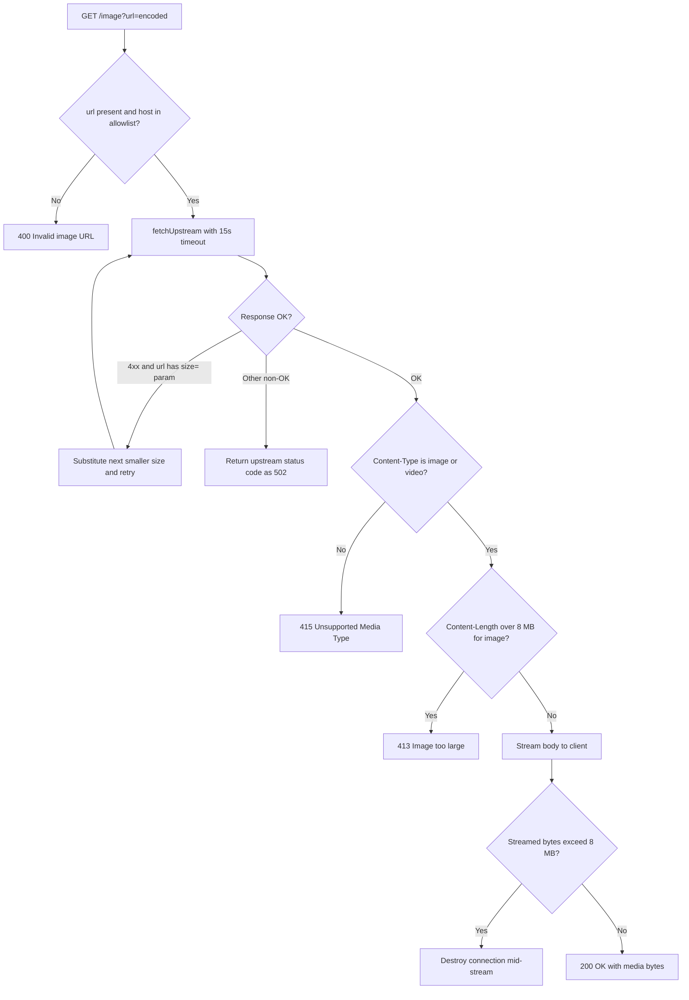

### Responses

#### 200 OK — Media streamed successfully

Headers: `Content-Type: image/jpeg` (or appropriate type), `Cache-Control: public, max-age=3600`, `X-Relay-Source: <hostname>`

Body: raw image or video bytes.

#### 400 Bad Request — Missing or disallowed URL

```
Invalid image URL
```

#### 413 Request Entity Too Large — Image exceeds 8 MB

```
Image too large
```

#### 415 Unsupported Media Type — Upstream returned non-image/video content

```
Upstream response is not an image or video
```

#### 502 Bad Gateway — Upstream fetch failed, timed out, or returned an error status

```
Relay failed: <error message>
```

or

```
Upstream error: 503
```

### Dependencies

- `ALLOWED_IMAGE_HOSTS` constant — `redvelvet.co.za`, `www.redvelvet.co.za`, `esa.co.za`, `www.esa.co.za`, `userfiles.esa.co.za`, `goldmember.esa.co.za`
- `MAX_IMAGE_BYTES` = 8 MB cap (`constants.js`)
- `REQUEST_TIMEOUT_MS` = 15 s per upstream fetch
- Size fallback chain: `large → medium → small → thumb_blur`

---

## 2. GET /rv-auth-status

**Handler:** inline in `src/server/router.js` → `src/server/redvelvet/auth.js:getSessionCookie`

### Auth

None / public.

### Input

No query parameters.

```
GET /rv-auth-status
```

### Logic flow

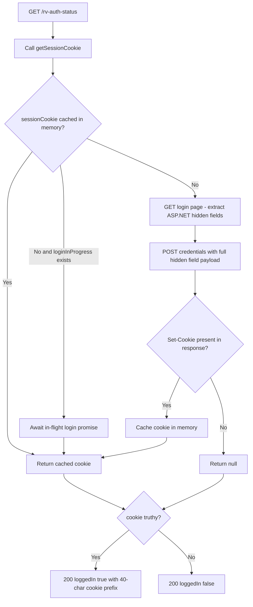

### Responses

#### 200 OK — Session active

```json
{ "loggedIn": true, "cookie": "ASP.NET_SessionId=abc123xyz…" }
```

#### 200 OK — Not logged in

```json
{ "loggedIn": false, "cookie": null }
```

### Dependencies

- `redvelvet/auth.js` — two-step ASP.NET login; deduplicates concurrent login attempts
- `RV_EMAIL` / `RV_PASSWORD` environment variables
- `redvelvet.co.za/userlogin/login` — upstream login page
- `extractHiddenFields` (utils/html.js)

---

## 3. GET /redvelvet-area

**Handler:** `src/server/redvelvet/areas.js:handleRedvelvetAreaLookup`

### Auth

None / public.

### Input

| Field | Type | Constraints | Required |
|---|---|---|---|
| `name` | string (query) | Area name; normalized internally (lowercase, trimmed) | Yes |

```
GET /redvelvet-area?name=Sea+Point
```

### Logic flow

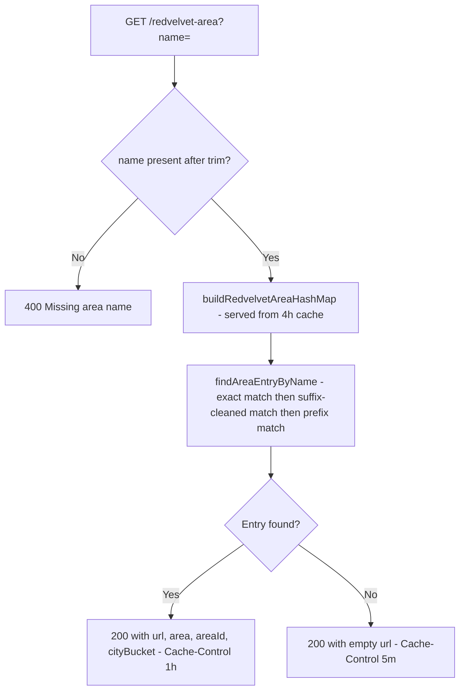

### Responses

#### 200 OK — Area resolved

```json
{
  "url": "https://redvelvet.co.za/escorts/escorts_in_area/sea-point/123/2",
  "area": "sea point",
  "areaId": "123",
  "cityBucket": "2"
}
```

#### 200 OK — Area not found

```json
{ "url": "" }
```

#### 400 Bad Request

```json
{ "error": "Missing area name" }
```

#### 502 Bad Gateway — Area map fetch failed

```json
{ "error": "<message>" }
```

### Dependencies

- `buildRedvelvetAreaHashMap` — scrapes `redvelvet.co.za/escorts/escorts_in_area`, 4 h in-memory cache
- `normalizeAreaName` (utils/normalize.js)
- `findAreaEntryByName` — prefers `cityBucket=2`, falls back to first match

---

## 4. GET /redvelvet-area-profiles

**Handler:** `src/server/redvelvet/areas.js:handleRedvelvetAreaProfiles`

### Auth

None / public.

### Input

| Field | Type | Constraints | Required |
|---|---|---|---|
| `name` | string (query) | Area name | Yes |
| `cityBucket` | string (query) | City bucket to prefer when resolving the area; defaults to `"2"` | No |

```
GET /redvelvet-area-profiles?name=Sea+Point&cityBucket=2
```

### Logic flow

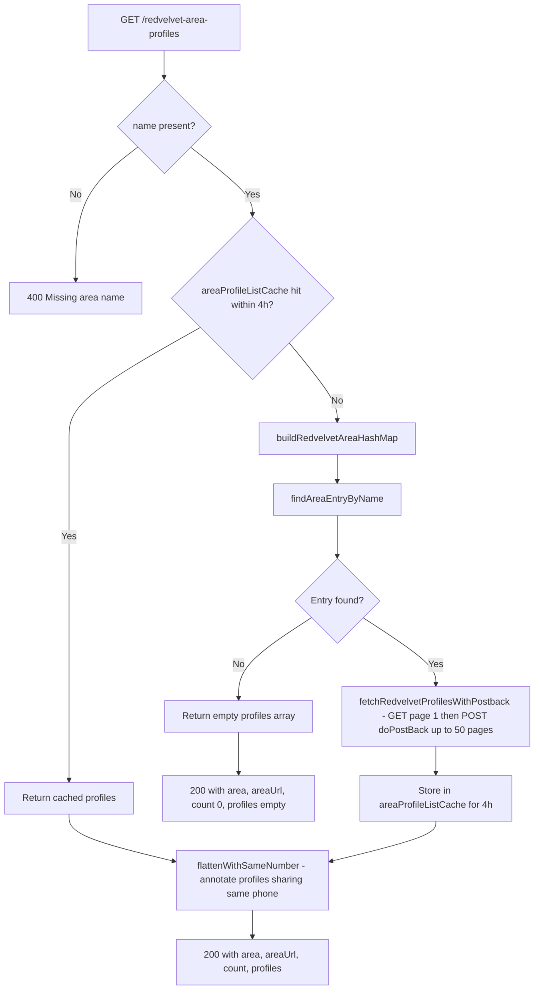

### Responses

#### 200 OK

```json
{
  "area": "sea point",
  "areaUrl": "https://redvelvet.co.za/escorts/escorts_in_area/sea-point/123/2",
  "count": 42,
  "profiles": [
    {
      "provider": "redvelvet",
      "uid": "99001",
      "name": "Jane",
      "area": "Sea Point",
      "profileUrl": "https://redvelvet.co.za/escorts/escorts_details/Jane/Sea-Point/99001",
      "thumbUrl": "https://redvelvet.co.za/uploadimages/jane.jpg",
      "phone": "0821234567",
      "profiles_with_same_number": []
    }
  ]
}
```

#### 400 Bad Request

```json
{ "error": "Missing area name" }
```

#### 502 Bad Gateway

```json
{ "error": "<message>" }
```

### Dependencies

- `buildRedvelvetAreaHashMap`, `fetchRedvelvetProfilesWithPostback` (`redvelvet/areas.js`)
- `flattenWithSameNumber` (`utils/groups.js`) — annotates `profiles_with_same_number`
- ASP.NET `__doPostBack` pagination — up to 50 pages, 45 s timeout per page
- `areaProfileListCache` — in-memory Map, 4 h TTL

---

## 5. GET /redvelvet-areas

**Handler:** `src/server/redvelvet/areas-list.js:handleRedvelvetAreas`

### Auth

None / public.

### Input

| Field | Type | Constraints | Required |
|---|---|---|---|
| `cityBucket` | string (query) | Filter to areas belonging to this bucket (e.g. `"2"`). Omit to return all. | No |

```
GET /redvelvet-areas?cityBucket=2
```

### Logic flow

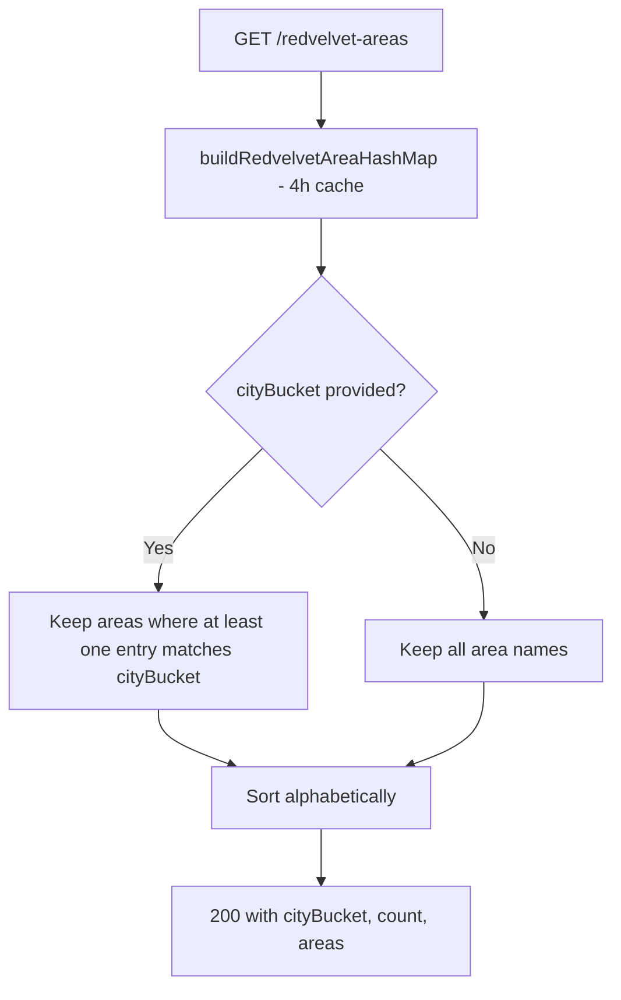

### Responses

#### 200 OK

```json
{
  "cityBucket": "2",
  "count": 38,
  "areas": ["atlantic seaboard", "bellville", "cape town cbd"]
}
```

#### 502 Bad Gateway

```json
{ "error": "<message>" }
```

### Dependencies

- `buildRedvelvetAreaHashMap` (`redvelvet/areas.js`) — scrapes `redvelvet.co.za/escorts/escorts_in_area`, 4 h cache

---

## 6. GET /redvelvet-tags

**Handler:** `src/server/redvelvet/tags.js:handleRedvelvetTags`

### Auth

None / public.

### Input

No query parameters.

```
GET /redvelvet-tags
```

### Logic flow

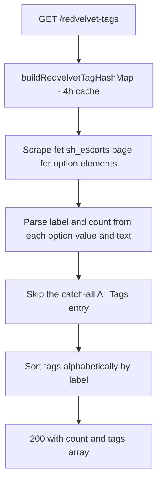

### Responses

#### 200 OK

```json
{
  "count": 24,
  "tags": [
    { "label": "Asian", "url": "https://redvelvet.co.za/escorts/fetish_escorts?...", "count": 15 },
    { "label": "BDSM", "url": "https://redvelvet.co.za/escorts/fetish_escorts?...", "count": 8 }
  ]
}
```

#### 502 Bad Gateway

```json
{ "error": "<message>" }
```

### Dependencies

- `buildRedvelvetTagHashMap` — scrapes `redvelvet.co.za/escorts/fetish_escorts`, 4 h in-memory cache
- `normalizeTagName`, `stripTags`, `decodeHtmlEntities` utilities

---

## 7. GET /redvelvet-tag-profiles

**Handler:** `src/server/redvelvet/profiles.js:handleRedvelvetTagProfiles`

### Auth

None / public.

### Input

| Field | Type | Constraints | Required |
|---|---|---|---|
| `tag` | string (query) | Tag label to look up (e.g. `"Asian"`) | Required if `tagUrl` absent |
| `tagUrl` | string (query) | Direct `fetish_escorts` URL (bypasses tag map lookup) | Required if `tag` absent |
| `cityBucket` | string (query) | City bucket for area filtering; defaults to `"2"` | No |

```
GET /redvelvet-tag-profiles?tag=Asian&cityBucket=2
```

### Logic flow

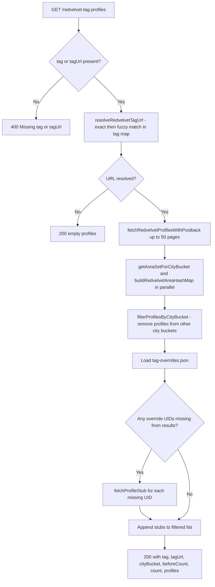

### Responses

#### 200 OK

```json
{
  "tag": "Asian",
  "tagUrl": "https://redvelvet.co.za/escorts/fetish_escorts?...",
  "cityBucket": "2",
  "beforeCount": 35,
  "count": 28,
  "profiles": [
    {
      "provider": "redvelvet",
      "uid": "88001",
      "name": "Yuki",
      "area": "Sea Point",
      "profileUrl": "https://redvelvet.co.za/escorts/escorts_details/Yuki/Sea-Point/88001",
      "thumbUrl": "https://redvelvet.co.za/uploadimages/yuki.jpg",
      "phone": ""
    }
  ]
}
```

#### 200 OK — Tag not found

```json
{ "tag": "Unknown", "tagUrl": "", "cityBucket": "2", "beforeCount": 0, "count": 0, "profiles": [] }
```

#### 400 Bad Request

```json
{ "error": "Missing tag or tagUrl" }
```

#### 502 Bad Gateway

```json
{ "error": "<message>" }
```

### Dependencies

- `resolveRedvelvetTagUrl` (`redvelvet/tags.js`)
- `fetchRedvelvetProfilesWithPostback`, `filterProfilesByCityBucket`, `getAreaSetForCityBucket` (`redvelvet/areas.js`)
- `tag-overrides.json` — optional local file for manual UID additions per tag

---

## 8. GET /redvelvet-profile-details

**Handler:** `src/server/redvelvet/profile-details.js:handleRedvelvetProfileDetails`

### Auth

None / public. The server internally uses the RV session cookie (from `getSessionCookie`) when fetching upstream profile pages.

### Input

| Field | Type | Constraints | Required |
|---|---|---|---|
| `id` | string (query) | Numeric UID | Yes |

```
GET /redvelvet-profile-details?id=88001
```

### Logic flow

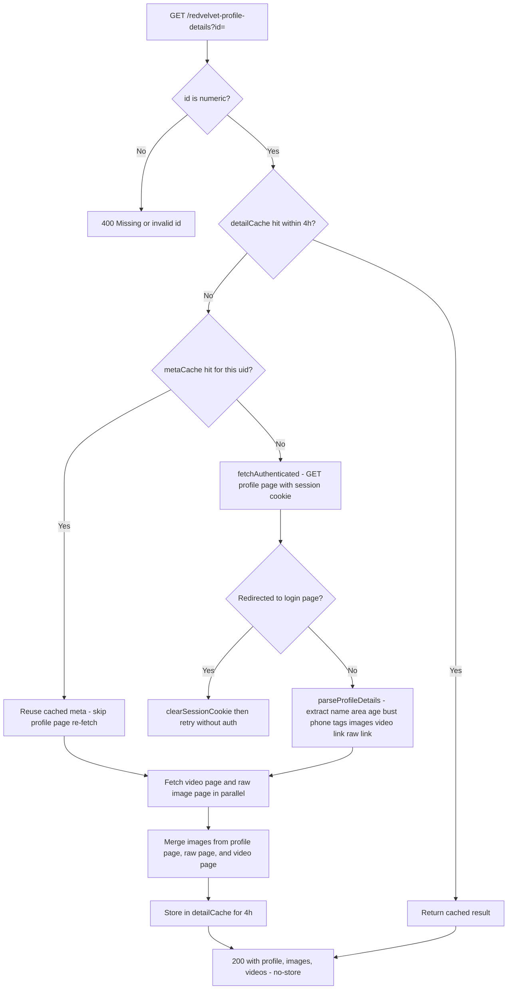

### Responses

#### 200 OK

```json
{
  "profile": {
    "provider": "redvelvet",
    "uid": "88001",
    "name": "Yuki",
    "area": "Sea Point",
    "areaUrl": "https://redvelvet.co.za/escorts/escorts_in_area/sea-point/123/2",
    "thumbUrl": "https://redvelvet.co.za/uploadimages/yuki1.jpg",
    "profileUrl": "https://redvelvet.co.za/escorts/escorts_details/Yuki/Sea-Point/88001",
    "phone": "0821234567",
    "age": "25",
    "bust": "34C",
    "tags": ["Asian", "BDSM"]
  },
  "images": [
    "https://redvelvet.co.za/uploadimages/yuki1.jpg",
    "https://redvelvet.co.za/uploadimages/yuki2.jpg"
  ],
  "videos": ["https://redvelvet.co.za/selfies/up/yuki.mp4"]
}
```

#### 400 Bad Request

```json
{ "error": "Missing or invalid id param (must be numeric)" }
```

#### 502 Bad Gateway

```json
{ "error": "<message>" }
```

### Dependencies

- `redvelvet/auth.js:getSessionCookie` — session cookie for authenticated upstream fetches
- `metaCache` — in-memory Map, 4 h TTL (lightweight age/bust metadata)
- `detailCache` — in-memory Map, 4 h TTL (full profile with images/videos)
- `redvelvet.co.za` — profile detail page, video page (`/selfies/escort_videos/`), raw page (`/escorts/raw_escort_details/`)
- `buildRedvelvetAreaHashMap` — to resolve `areaUrl` from parsed area name

---

## 9. GET /redvelvet-nickname-search

**Handler:** `src/server/redvelvet/nickname-search.js:handleRedvelvetNicknameSearch`

### Auth

None / public.

### Input

| Field | Type | Constraints | Required |
|---|---|---|---|
| `nickname` | string (query) | Search term | Yes |
| `cityBucket` | string (query) | City bucket for filtering; defaults to `"2"` | No |

```
GET /redvelvet-nickname-search?nickname=Yuki&cityBucket=2
```

### Logic flow

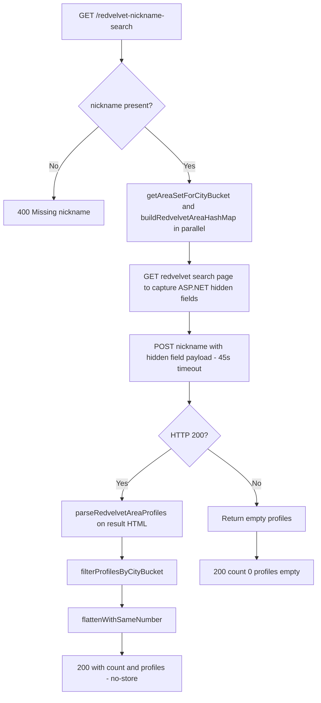

### Responses

#### 200 OK

```json
{
  "count": 2,
  "profiles": [
    {
      "provider": "redvelvet",
      "uid": "88001",
      "name": "Yuki",
      "area": "Sea Point",
      "profileUrl": "https://redvelvet.co.za/escorts/escorts_details/Yuki/Sea-Point/88001",
      "thumbUrl": "https://redvelvet.co.za/uploadimages/yuki.jpg",
      "phone": "",
      "profiles_with_same_number": []
    }
  ]
}
```

#### 400 Bad Request

```json
{ "error": "Missing nickname" }
```

#### 502 Bad Gateway

```json
{ "error": "<message>" }
```

### Dependencies

- `redvelvet.co.za/search/search` — ASP.NET WebForms search form
- `extractHiddenFields` (`utils/html.js`) — captures `__VIEWSTATE` and related fields
- `filterProfilesByCityBucket`, `buildRedvelvetAreaHashMap` (`redvelvet/areas.js`)
- `flattenWithSameNumber` (`utils/groups.js`)
- `POSTBACK_TIMEOUT_MS` = 45 s

---

## 10. POST /redvelvet-search

**Handler:** `src/server/redvelvet/search.js:handleRedvelvetSearch`

### Auth

None / public.

### Input (JSON body)

| Field | Type | Constraints | Required |
|---|---|---|---|
| `cityBucket` | string | Defaults to `"2"` | No |
| `areas.included` | string[] | Area names to union into result set | At least one of `areas.included` or `tags.included` required |
| `areas.excluded` | string[] | Area names to subtract from result set | No |
| `tags.included` | string[] | Tag labels to include | No |
| `tags.excluded` | string[] | Tag labels to subtract | No |
| `age.min` | number | Minimum age (triggers per-profile detail fetch) | No |
| `age.max` | number | Maximum age (triggers per-profile detail fetch) | No |
| `bust.band` | number | Exact band size e.g. `34` | No |
| `bust.cup` | string | Exact cup letter e.g. `"C"` | No |
| `bust.range.min` | number | Min bust volume index | No |
| `bust.range.max` | number | Max bust volume index | No |

```json
{
  "cityBucket": "2",
  "areas": { "included": ["Sea Point"], "excluded": [] },
  "tags": { "included": ["Asian"], "excluded": ["BDSM"] },
  "age": { "min": 20, "max": 30 },
  "bust": { "cup": "C" }
}
```

### Logic flow

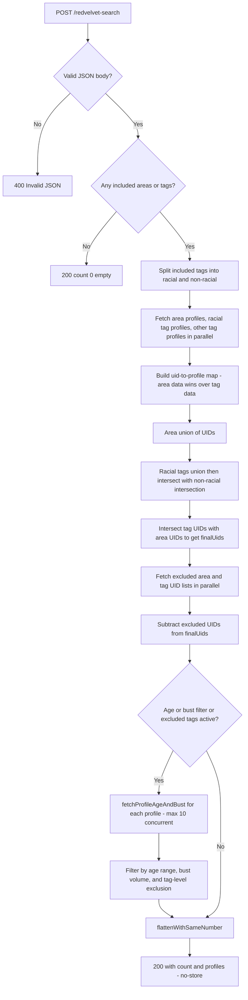

### Responses

#### 200 OK

```json
{
  "count": 12,
  "profiles": [
    {
      "provider": "redvelvet",
      "uid": "88001",
      "name": "Yuki",
      "area": "Sea Point",
      "profileUrl": "...",
      "thumbUrl": "...",
      "phone": "",
      "profiles_with_same_number": []
    }
  ]
}
```

#### 200 OK — No includes provided

```json
{ "count": 0, "groups": [] }
```

#### 400 Bad Request

```json
{ "error": "Invalid JSON body" }
```

#### 502 Bad Gateway

```json
{ "error": "<message>" }
```

### Dependencies

- `getRedvelvetAreaProfiles`, `filterProfilesByCityBucket` (`redvelvet/areas.js`)
- `resolveRedvelvetTagUrl` (`redvelvet/tags.js`)
- `fetchProfileAgeAndBust` (`redvelvet/profile-details.js`) — fetches meta detail page per profile when age/bust filter active; capped at 10 concurrent
- `RACIAL_TAGS` = `{ Asian, Black, Coloured, Indian, White }` — unioned rather than intersected
- `tagProfileCache` — in-memory Map, 4 h TTL
- `flattenWithSameNumber` (`utils/groups.js`)

---

## 11. GET /esa-areas

**Handler:** `src/server/esa/areas-list.js:handleEsaAreas`

### Auth

None / public.

### Input

No query parameters.

```
GET /esa-areas
```

### Logic flow

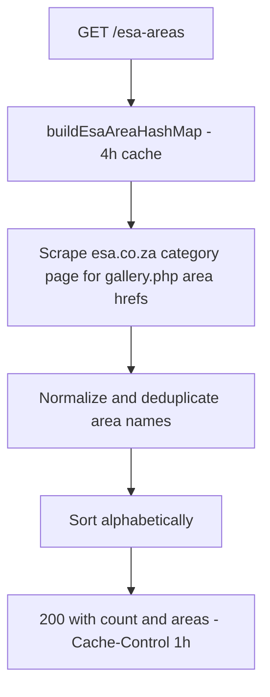

### Responses

#### 200 OK

```json
{
  "count": 25,
  "areas": ["Atlantic Seaboard", "Bellville", "Cape Town CBD"]
}
```

#### 502 Bad Gateway

```json
{ "error": "<message>" }
```

### Dependencies

- `buildEsaAreaHashMap` (`esa/areas.js`) — scrapes `www.esa.co.za/category.php?sp[city]=Cape Town`, 4 h cache
- `normalizeAreaName` (`utils/normalize.js`)

---

## 12. GET /esa-profiles?nickname=

**Handler:** `src/server/esa/profiles.js:handleEsaProfilesByNickname`

### Auth

None / public. Upstream ESA fetches go through `corsproxy.io`.

### Input

| Field | Type | Constraints | Required |
|---|---|---|---|
| `nickname` | string (query) | Search term | Yes |

```
GET /esa-profiles?nickname=Yuki
```

### Logic flow

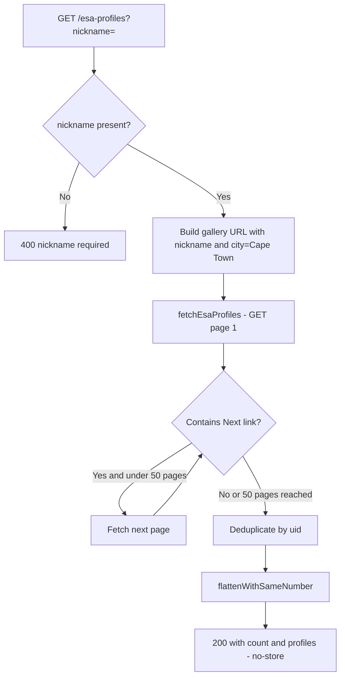

### Responses

#### 200 OK

```json
{
  "count": 3,
  "profiles": [
    {
      "provider": "esa",
      "uid": "12345",
      "name": "Yuki",
      "area": "Sea Point",
      "profileUrl": "https://www.esa.co.za/escorts/viewEscort.php?uid=12345",
      "thumbUrl": "https://www.esa.co.za/client/gallery/srv.php?...",
      "phone": "0821234567",
      "profiles_with_same_number": []
    }
  ]
}
```

#### 400 Bad Request

```json
{ "error": "nickname required" }
```

#### 502 Bad Gateway

```json
{ "error": "<message>" }
```

### Dependencies

- `fetchEsaProfiles` (`esa/profiles.js`) — paginates via `Next »` link, up to 50 pages
- `ESA_GALLERY_URL` = `https://www.esa.co.za/gallery.php`
- `corsproxy.io` — CORS proxy used by `fetchText`
- `flattenWithSameNumber` (`utils/groups.js`)

---

## 13. GET /esa-profiles?area=

**Handler:** `src/server/esa/profiles.js:handleEsaProfilesByArea`

### Auth

None / public.

### Input

| Field | Type | Constraints | Required |
|---|---|---|---|
| `area` | string (query) | Area name | Yes |

```
GET /esa-profiles?area=Sea+Point
```

### Logic flow

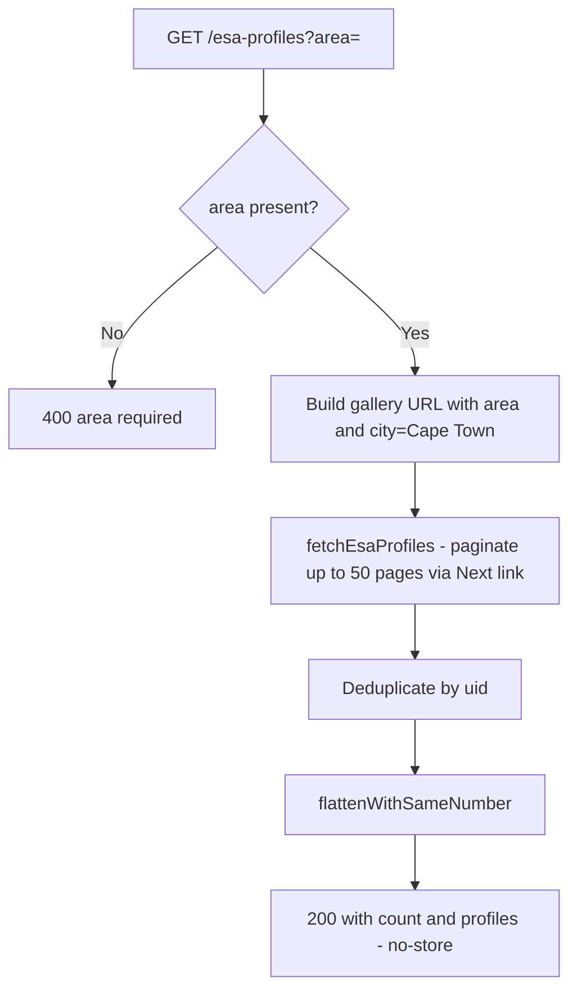

### Responses

#### 200 OK

```json
{
  "count": 18,
  "profiles": [
    {
      "provider": "esa",
      "uid": "12345",
      "name": "Yuki",
      "area": "Sea Point",
      "profileUrl": "https://www.esa.co.za/escorts/viewEscort.php?uid=12345",
      "thumbUrl": "https://www.esa.co.za/client/gallery/srv.php?...",
      "phone": "",
      "profiles_with_same_number": []
    }
  ]
}
```

#### 400 Bad Request

```json
{ "error": "area required" }
```

#### 502 Bad Gateway

```json
{ "error": "<message>" }
```

### Dependencies

- `fetchEsaProfiles` (`esa/profiles.js`) — paginates up to 50 pages
- `ESA_GALLERY_URL`
- `flattenWithSameNumber` (`utils/groups.js`)

---

## 14. GET /esa-profile-details

**Handler:** `src/server/esa/profile-details.js:handleEsaProfileDetails`

### Auth

None / public.

### Input

| Field | Type | Constraints | Required |
|---|---|---|---|
| `id` | string (query) | Numeric UID | Yes |

```
GET /esa-profile-details?id=12345
```

### Logic flow

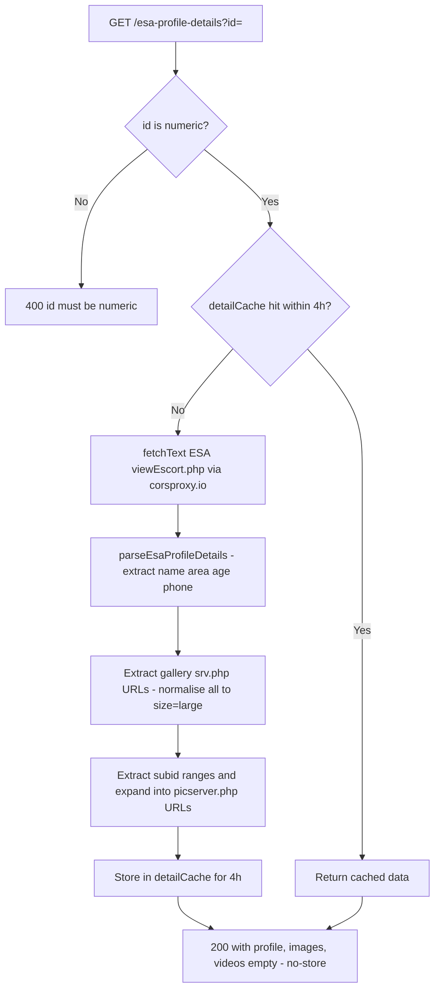

### Responses

#### 200 OK

```json
{
  "profile": {
    "provider": "esa",
    "uid": "12345",
    "name": "Yuki",
    "area": "Sea Point",
    "areaUrl": "https://www.esa.co.za/gallery.php?sp[area]=Sea+Point",
    "thumbUrl": "https://www.esa.co.za/client/gallery/srv.php?type=thumb&...",
    "profileUrl": "https://www.esa.co.za/escorts/viewEscort.php?uid=12345",
    "phone": "0821234567",
    "age": "25"
  },
  "images": [
    "https://www.esa.co.za/client/gallery/srv.php?type=photo&size=large",
    "https://goldmember.esa.co.za/picserver.php?type=picsets&subid=999&picnum=1&size=large"
  ],
  "videos": []
}
```

#### 400 Bad Request

```json
{ "error": "id must be numeric" }
```

#### 502 Bad Gateway

```json
{ "error": "<message>" }
```

### Dependencies

- `fetchText` (`utils/http.js`) — fetches via CORS proxy
- `detailCache` — in-memory Map, 4 h TTL
- `www.esa.co.za` — profile page
- `goldmember.esa.co.za/picserver.php` — expanded per-subid image URLs

---

## 15. POST /esa-search

**Handler:** `src/server/esa/search.js:handleEsaSearch`

### Auth

None / public.

### Input (JSON body)

| Field | Type | Constraints | Required |
|---|---|---|---|
| `areas.included` | string[] | Area names to union | At least one include required (unless `nickname` given) |
| `areas.excluded` | string[] | Area names to subtract | No |
| `nickname` | string | Nickname search term; when present, replaces area-union fetch | No |

```json
{
  "areas": { "included": ["Sea Point", "Green Point"], "excluded": ["Bellville"] }
}
```

or with nickname:

```json
{ "nickname": "Yuki", "areas": { "included": ["Sea Point"] } }
```

### Logic flow

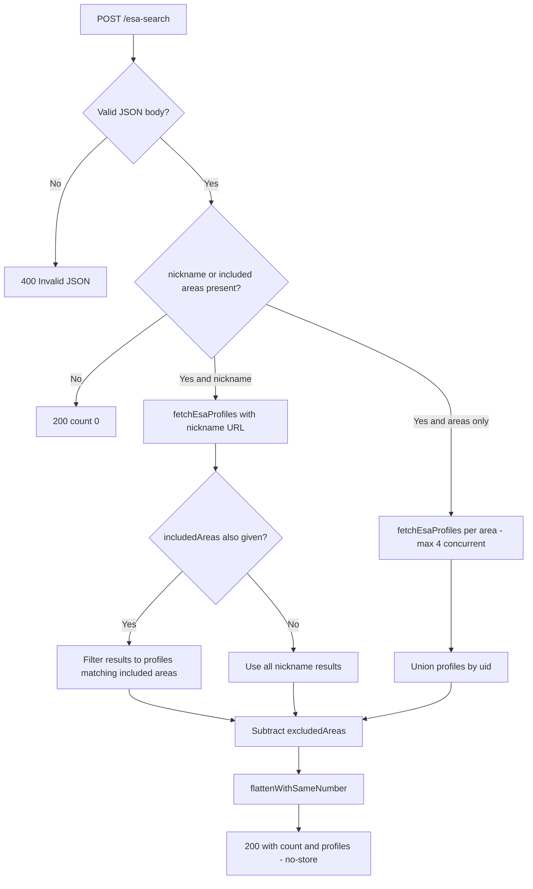

### Responses

#### 200 OK

```json
{
  "count": 22,
  "profiles": [
    {
      "provider": "esa",
      "uid": "12345",
      "name": "Yuki",
      "area": "Sea Point",
      "profileUrl": "...",
      "thumbUrl": "...",
      "phone": "",
      "profiles_with_same_number": []
    }
  ]
}
```

#### 200 OK — No includes provided

```json
{ "count": 0, "groups": [] }
```

#### 400 Bad Request

```json
{ "error": "Invalid JSON body" }
```

#### 502 Bad Gateway

```json
{ "error": "<message>" }
```

### Dependencies

- `fetchEsaProfiles` (`esa/profiles.js`) — concurrency limited to 4 via inline `pLimit`
- `normalizeAreaName` (`utils/normalize.js`)
- `flattenWithSameNumber` (`utils/groups.js`)
- `ESA_GALLERY_URL`

---

## 16. GET /profile-groups

**Handler:** `src/server/profile-groups.js:handleGetProfileGroups`

### Auth

None / public (local server only — not exposed externally).

### Input

No parameters.

```
GET /profile-groups
```

### Logic flow

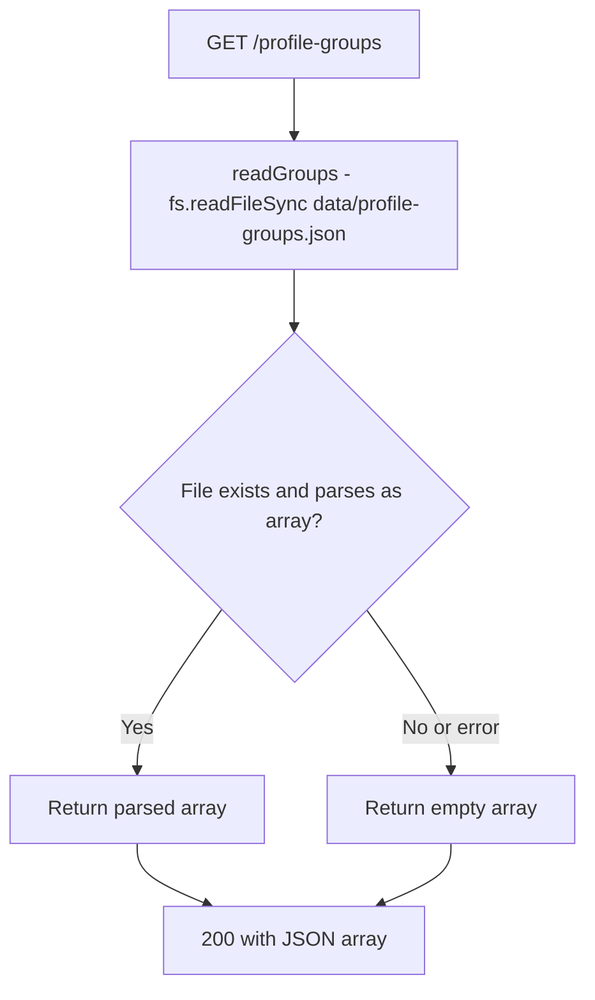

### Responses

#### 200 OK — Has groups

```json
[
  { "name": "Favourites Group 1", "links": ["https://redvelvet.co.za/..."] }
]
```

#### 200 OK — No file or parse error

```json
[]
```

### Dependencies

- `data/profile-groups.json` — local filesystem (created on first POST)

---

## 17. POST /profile-groups

**Handler:** `src/server/profile-groups.js:handleSaveProfileGroups`

### Auth

None / public (local server only).

### Input (JSON body)

| Field | Type | Constraints | Required |
|---|---|---|---|
| body | array | Must be a valid JSON array | Yes |

```json
[{ "name": "Group 1", "links": ["https://redvelvet.co.za/..."] }]
```

### Logic flow

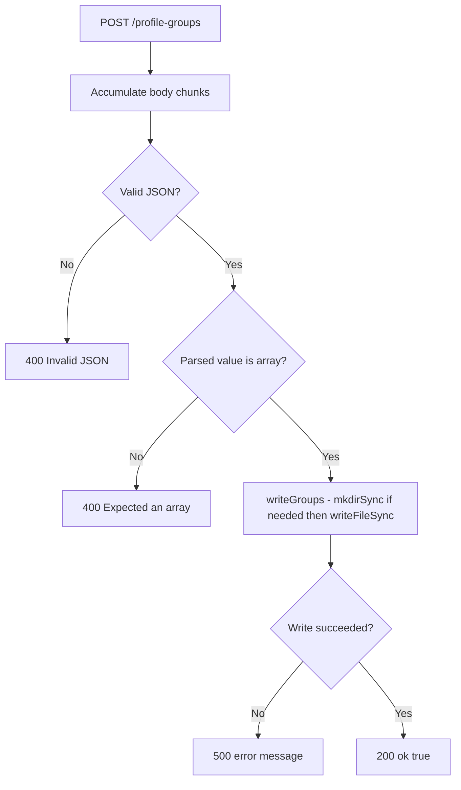

### Responses

#### 200 OK

```json
{ "ok": true }
```

#### 400 Bad Request — Invalid JSON

```json
{ "error": "Invalid JSON" }
```

#### 400 Bad Request — Not an array

```json
{ "error": "Expected an array" }
```

#### 500 Internal Server Error

```json
{ "error": "<message>" }
```

### Dependencies

- `data/profile-groups.json` — local filesystem; `data/` directory created automatically if absent

---

## 18. GET /favorites

**Handler:** `src/server/favorites.js:handleGetFavorites`

### Auth

None / public (local server only).

### Input

No parameters.

```
GET /favorites
```

### Logic flow

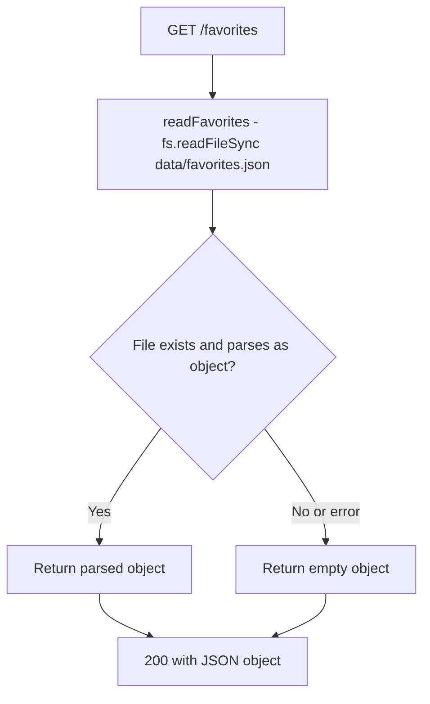

### Responses

#### 200 OK — Has favorites

```json
{
  "esa": {
    "12345": { "uid": "12345", "name": "Yuki", "provider": "esa" }
  },
  "redvelvet": {}
}
```

#### 200 OK — No file or parse error

```json
{}
```

### Dependencies

- `data/favorites.json` — local filesystem (created on first POST)

---

## 19. POST /favorites

**Handler:** `src/server/favorites.js:handleSaveFavorites`

### Auth

None / public (local server only).

### Input (JSON body)

| Field | Type | Constraints | Required |
|---|---|---|---|
| body | object | Must be a JSON plain object (not array, not null) | Yes |

```json
{
  "esa": { "12345": { "uid": "12345", "name": "Yuki", "provider": "esa" } },
  "redvelvet": {}
}
```

### Logic flow

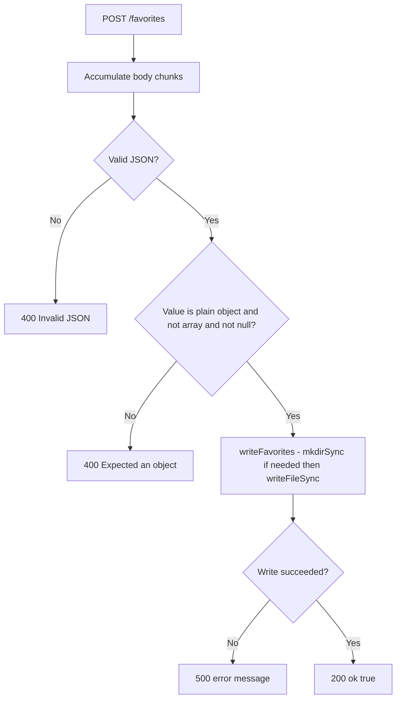

### Responses

#### 200 OK

```json
{ "ok": true }
```

#### 400 Bad Request — Invalid JSON

```json
{ "error": "Invalid JSON" }
```

#### 400 Bad Request — Not a plain object

```json
{ "error": "Expected an object" }
```

#### 500 Internal Server Error

```json
{ "error": "<message>" }
```

### Dependencies

- `data/favorites.json` — local filesystem; `data/` directory created automatically if absent
